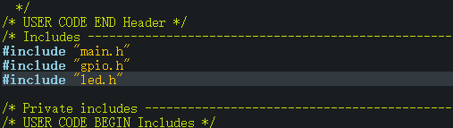
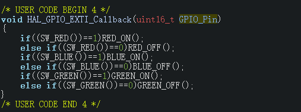

## 第一次培训作业分析

### 璨

选择引脚不是很好，问题在于我们设计的开发板上面没有单独设计这三个引脚的GPIO引出。

其次，没有设计上拉下拉电平，建议改成接上拉电阻或下拉电阻

自己写的程序，放在USER CODE BEGIN和USER CODE END中间，具体在那个中间，请参考注释。

判断值，如果官方有相关宏定义，则使用宏定义的值，而尽量避免使用自己的值。

注意代码格式规范（写好点可以方便未来维护代码）。

和下面25的板件移植性能差的问题类似，注意使用宏定义。按键的东西不要放在led的库里。

### 25

时钟配置不太好，如果没有特殊需求，一般把时钟开到最高，这样可以满足绝大部分需求。

图略

同样没有考虑到引脚引出的问题，同时，没有考虑到引脚上拉下拉电阻的部分。

没引用自己的库，这样编译会出问题。

case语句中宏定义没写对，这个GPIO_Pin的内容出现在main.h中。格式规范也有点问题，下图为修改部分后。另外，宏定义加了括号，而此处引用时没有加括号。

初次之外，没有default语句，这样写不是很好。

程序耦合度太高，这样不利于板间移植。

## 学习硬件内存

在编译之后可以通过build analyzer去查看具体的内存占用。关于Flash、RAM、CCMRAM和代码分段相关的知识，可以自行百度。

## 串口

关于串口的时序我就不详细说了。

参数设置，主要就是如下的内容：

现在电脑上的串口设备实际上时USB转串口设备，现在普通的个人机上面是不存在真正的串口的，实际上它们大多是利用USB去转换模拟出的串口。

## 本次任务

参考我的例程，使用HAL库对printf进行一次封装。同时尝试去做一下HAL库的中断回调，去实现输入指令，然后让灯执行相应操作。比如：

电脑通过串口调试助手指令：RED_ON，此时红灯点亮，如果RED_TOGGLE，则翻转电平等等，至少要实现九种指令。

也可以去尝试一下使用LL库完成第一次培训的内容。